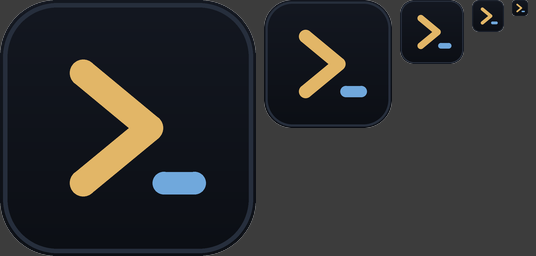

# tsumugi（紡ぎ）

> **ターミナルの画面そのものを、vim で編集できるドキュメントとして扱う。
> そしてその全操作にマウスの道を用意する。**

スクロールバックを「読んで・選んで・編集できるバッファ」として扱い、
中で走っている AI エージェントが**いつ人の番になったか**を知っている
ターミナルエミュレータ。

Rust 製。いまのところ **Windows**。macOS と Linux はビルドは通りますが
**まだ誰も動かしていません**（[いまの状態](#いまの状態)）。



## なぜもう 1 つ端末を作るのか

**1. スクロールバックはログではなく文書。** `j` `k` `w` `[[` `]]` で歩き、
`ac` でコマンドと出力をまるごと選び、ヤンクし、`jq` に通し、同じペインで
`:e` を打てばファイルが開く。エディタから見れば格子もファイルも同じ
「文書」なので、同じキーが両方に効く。

**2. すべてのコマンドにマウスの道がある — CI で強制している。**
コマンド表を走査して、マウス経路の無いコマンドがあればテストが落ちる。
ダブルクリックでパスや URL をまるごと選ぶ。左のふちにはコマンドの成否が出て、
押せばそのコマンドと出力が選べる。右クリックは**いまここで**できることを出す。

**3. エージェントが何をしているか分かる。** Claude Code や Codex を 3 つ
並べると、返事待ちのタブに ● が付き、`Space a` でそこへ飛ぶ。
全部へ同じ指示を投げて（`Space b`）、返事を並べて見比べられる
（`tsg --compare`）。状態は**エージェント自身のフックが名乗る**もので、
画面から推測してはいない — 推測は、相手が出力の形を変えた日に黙って壊れる。

ウィンドウを閉じてもシェルは死なない。多重化は別プロセスなので、開き直せば
続きから使える。開いていたファイルも、保存していない変更も残っている。

## 入れる

```
git clone https://github.com/hyuga611/tsumugi
cd tsumugi
cargo build --release
./target/release/tsg --install
```

`--install` はスタートメニュー・デスクトップ・PATH・フォルダの右クリックに
登録します。**exe は動かしません** — ビルドした場所を指すだけです。
`tsg --uninstall` で全部戻り、何を変えたかは毎回画面に出ます。

強く推奨（1 回だけ）:

```
tsg --install-shell-integration     # OSC 133: プロンプト位置・終了コード・コマンドブロック
```

これが無いと `[[` `]]`・左のふち・`ac` / `io` は手がかりを持てません。

> **Windows の SmartScreen**: 署名していないので初回に「Windows によって
> PC が保護されました」が出ます。詳細情報 → 実行。スマート アプリ
> コントロールが有効だと**そもそも起動できません**（この機能を切る以外に
> 手がなく、切ると元に戻せません）。

## 最初の 5 分

開いて **F1**。使い方は「マウスだけで使えます」から始まります。

| | |
|---|---|
| 打つ | 普通のターミナルです |
| `Esc` | 読むモード。下の帯の色が変わります |
| 帯を押す | キーを知らなくても 入力 ⇄ 読む を行き来できます |
| ダブルクリック | 語・パス・URL をまるごと |
| `Ctrl`＋クリック | そのパスや URL を開く |
| 右クリック | いまここでできること |
| 下の `≡` | すべてのコマンド（打って絞り込めます） |

## できること

**読む・編集する** — スクロールバックの上で vim のモーション、
テキストオブジェクト（`ac` コマンドブロック / `io` 出力 / `if` パス /
`iu` URL / `ih` ハッシュ）、オペレータ（`d` `c` `y` `=` `>`）、
マーク・マクロ・レジスタ・取り消し。`:e` でペインがエディタになり、
`:w` で保存、`:q` で端末へ戻ります。

**探す・飛ぶ・畳む** — `/` は打つたびに飛び、一致を光らせます。
`Space l` で画面のパスと URL にラベルが付き、1 キーで開きます。
`Space o` でコマンドの出力を畳み、畳んだ行には**何を畳んだか**が出ます。

**ペインとセッション** — 分割・ズーム・入れ替え・リサイズ・タブ・
名前付きセッション・デタッチと再アタッチ。`Space S` で走っているものを一覧。

**出力を読む** — 構文強調、`git diff` の色分け（`Space g`）、
Markdown をその場で読む形に（`Space m`）、画像（Kitty graphics）。

**見た目** — 配色 3 種＋色の個別上書き、合字、既定で透過とぼかし、
日本語 / 英語、モードに連動する IME。

## AI エージェントと使う

```
tsg --install-agent-hooks          # Claude Code / Codex に配線（1 回だけ）
```

| | |
|---|---|
| タブの `●` | 返事待ち |
| `✓` / `✕` | 終わった / 失敗 |
| 下の `● 返事待ち N` | 押すとそこへ飛ぶ |
| `Space a` | 次の返事待ちへ |
| タスクバーの点滅 | 窓が裏に居るときだけ・変わった瞬間だけ |

終了コードで答えるので `if` に書けます。

```
tsg --agents                          # session <TAB> pane <TAB> state
tsg --prompt "テストを直して" --wait
tsg --wait --until done --timeout 600
tsg --broadcast "この diff を見て" --wait   # 見えているペイン全部へ
tsg --compare                              # 返事を 1 枚に並べる
tsg --layout agents                        # 3 分割で開く
```

## 設定

`%APPDATA%\tsumugi\config.toml`（Unix は `~/.config/tsumugi/config.toml`）。
無くても動き、壊れていても既定で起動して警告だけ出します。
**メニュー → 設定ファイルを開く**で、書けるものが全部コメントで並んだ
雛形ごと作られます。

```toml
[ui]
lang = "auto"                 # "ja" / "en" / "auto"

[window]
opacity = 0.85
blur = true

[font]
size = 18.0
family = "Cascadia Code"      # 無ければ既定の候補へ落ちます
ligatures = true
ambiguous_width = "narrow"    # "wide" で罫線素片などを 2 幅に

[theme]
name = "夜霧"                  # 夜霧 / 墨 / 白磁
```

保存した瞬間に効きます。

## 外から動かす

多重化のソケットは**自分だけに閉じて**います。便利なコマンドは薄い皮で、
`--rpc` が最後の逃げ道です。

```
tsg --list                     # 走っているセッション
tsg --capture                  # ペインに見えているものをテキストで
tsg --open README.md --render  # 走っている窓でファイルを開く
tsg --search "TODO"            # 外から探す（n / N でたどれる）
tsg --run <コマンド id>        # 画面の側のコマンド（一覧は --commands）
tsg --rpc                      # 生のプロトコル（docs/rpc.md）
```

## いまの状態

**Windows** で開発し、実機で確かめています。この README に書いたことは
すべて実機で見ました。

**macOS と Linux** はビルドが通り、端末・多重化・エディタ・モーダルの層は
プラットフォームに依りませんが、ウィンドウの装飾・IME・`--install` は
Windows の API で書いてあり、**まだ誰も動かしていません**。対応済みではなく
未検証として扱ってください。

まだ無いもの: Sixel、行をまたぐ構文強調、リサイズ時のスクロールバック
再折り返し、SSH 越しのセッション、キーバインドのカスタマイズ、
OSC 8 ハイパーリンク。合字は動きますがこの開発機に合字を持つ字体が無く
確認できていません（`tsg --diagnose` がそう言います）。

## セキュリティ

多重化のソケットは自分のユーザだけに閉じ、繋いできた相手が自分かを確かめます。
スクロールバックは多重化サーバのメモリの中だけにあり、**ディスクには書きません**。
端末のエスケープは信用しない入力として扱います（OSC 52 は書き込みだけ受けて
読み出しには答えない、よそのホストの `file://` は断る、画像の大きさに上限を置く）。

詳細と報告の窓口は [SECURITY.md](SECURITY.md)。

## 設計

設計文書 4 本がコードより先にあり、いまも正本です。

- [docs/concept.md](docs/concept.md) — 中心命題と、そこから導かれるもの
- [docs/modal-spec.md](docs/modal-spec.md) — モーダル層
- [docs/mouse-parity.md](docs/mouse-parity.md) — 全コマンドのマウス経路
- [docs/arch.md](docs/arch.md) — アーキテクチャ・不変条件・マイルストーン

マイルストーンごとに実測の記録（`docs/m*-results.md`）があり、
**うまくいかなかったことも**書いてあります。

## ライセンス

MIT または Apache-2.0。
