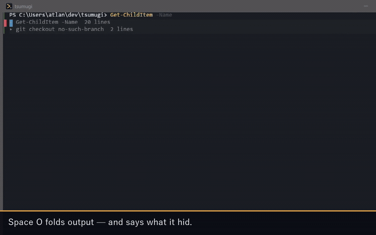
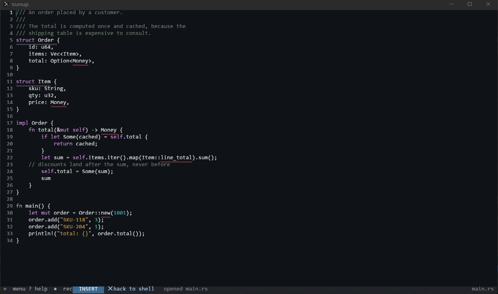
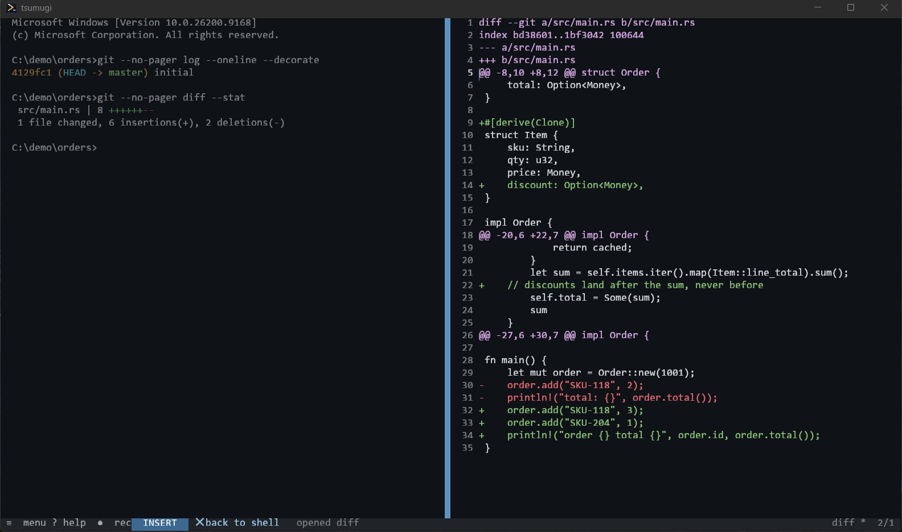
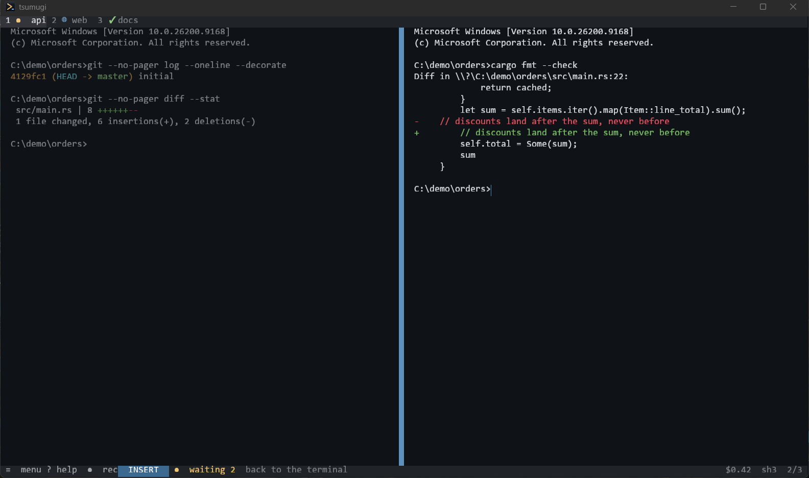
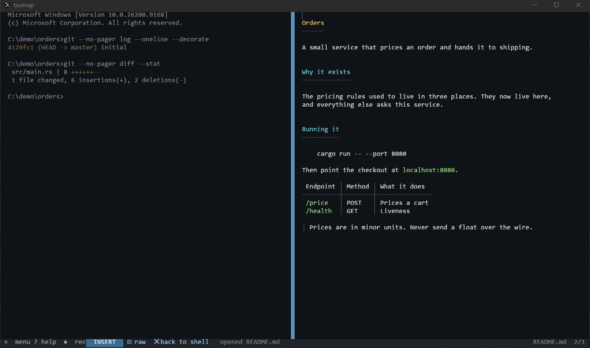

# tsumugi

> **The terminal screen is a document. Read it, select it, edit it — with vim
> motions or with the mouse. Every command has both.**

A terminal emulator that treats scrollback as a buffer you can navigate, and
that knows when the AI agent running inside it is waiting for you.

Rust. Windows today; macOS and Linux build but are **not yet tested** (see
[Status](#status)).

日本語の説明は [README.ja.md](README.ja.md) にあります。



| | |
|---|---|
|  |  |
| Line numbers, syntax highlighting, and squiggles from the language server | The shell on the left, `git diff` on the right |
|  |  |
| Named tabs carry each agent's state; the bar counts who is waiting for you | Markdown rendered in place |

## Why another terminal

**1. The scrollback is a document, not a log.** Move with `j` `k` `w` `[[` `]]`,
select a whole command block with `ac`, yank it, pipe it through `jq`, open a
file in the same pane with `:e`. The grid and a file buffer are the same thing
to the editor, so the same keys work on both.

**2. Every command is reachable with the mouse — enforced in CI.** A test walks
the command registry and fails if any command lacks a mouse path. Double-click
selects a path or URL as one token. The left gutter marks each command's exit
code; click it to select that command and its output. Right-click shows what you
can do *here*.

**3. It knows what your agents are doing.** Run Claude Code or Codex in three
panes; the tab shows ● when one is waiting for you, and `Space a` jumps there.
Send one prompt to all of them (`Space b`) and compare the answers
(`tsg --compare`). The state is **reported by the agent's own hooks**, not
guessed from the screen — guessing breaks silently the day the output changes.

Closing the window does not kill your shells: the multiplexer is a separate
process, so reopening puts you back where you were, including files you had
open and had not saved.

## Install

One line in PowerShell. No admin rights needed.

```powershell
irm https://raw.githubusercontent.com/hyuga611/tsumugi/main/install.ps1 | iex
```

It downloads the latest `tsg.exe` into `%USERPROFILE%\bin` and runs `tsg --install`
for you. **That one line leaves you with a working setup**: besides the Start Menu,
PATH and context-menu entries, it installs the shell integration (without it the left
gutter, `[[`, `ac` and `go` do nothing) and, when they are present, the Claude Code and
Codex hooks. **Every change is printed, and `tsg --uninstall` takes all of it back out.** The executable links the CRT statically, so it runs on machines **without
the VC++ redistributable**. Set `$env:TSUMUGI_DIR = 'D:\tools'` beforehand for a
different location, `$env:TSUMUGI_NO_REGISTER = '1'` to skip the shortcuts, or
`$env:TSUMUGI_VERSION = 'v0.1.0'` to pin a version.

After that, the copy you installed can do it itself:

```powershell
tsg update                    # fetch the latest release and swap it in
tsg update --force            # reinstall even if it is the same version
tsg update --stop-sessions    # also stop running sessions (their shells end too)
```

A running multiplexer is still the old executable, so a release that moved the
protocol cannot be reached from the new one. By default it does **not** stop
them: it prints the names of the running sessions and how to stop each one,
because stopping one means ending the shells and agents inside it.

**It downloads nothing when you are already on the latest** (it says
`Already on v0.3.4.` and stops). Underneath it runs the same `install.ps1`, so
there is only ever one way to install. A running executable cannot delete
itself, so the old one stays as `tsg.exe.old-…` and the next `tsg update`
removes it. A binary you built with `cargo build` is **never overwritten** —
it says so and tells you what to do instead.

Building it yourself:

```
git clone https://github.com/hyuga611/tsumugi
cd tsumugi
cargo build --release
./target/release/tsg --install
```

`--install` adds a Start Menu and desktop shortcut, puts `tsg` on your PATH, and
adds "Open tsumugi here" to the folder context menu. **It does not move the
executable** — it points at wherever you built it. `tsg --uninstall` removes
everything it added, and every change is printed as it happens.

`tsg --install` already installed the shell integration, so there is usually
nothing to do here. Only if you want it in another shell, or want it back:

```
tsg --install-shell-integration bash     # bash / zsh / fish / pwsh / nu
tsg --uninstall-shell-integration        # takes the line back out
```

Without it, `[[` `]]`, the gutter, `ac` / `io` and `go` have nothing to work from.

> **Windows SmartScreen**: the binary is unsigned, so the first launch shows
> "Windows protected your PC". More info → Run anyway. If Smart App Control is
> on, it will block the binary outright; there is no workaround short of turning
> that feature off, which is irreversible.

## The first five minutes

Open it and press **F1**. The help starts with what the mouse alone can do.

| | |
|---|---|
| type | it is a normal terminal |
| `Esc` | reading mode — the bar at the bottom changes colour |
| click the bar | toggles typing ⇄ reading without knowing any keys |
| double-click | select a word, path or URL as one |
| `Ctrl`+click | open that path or URL |
| right-click | everything you can do here |
| `≡` at the bottom | every command, searchable |

## Workspaces (`go`)

`cd` to where you want to work and type **`go`**.

```
cd ~/dev/tsumugi
go
```

The pane you are in becomes the middle one, a **directory tree opens on the
left and an AI agent on the right**, and **the tab is renamed after the
directory**. One tab per repository, and the tab names tell you which is which.

| | |
|---|---|
| `j` `k` `/` in the tree | the usual reading mode - **the tree is a buffer**, so nothing new to learn |
| `Enter` / double-click | folds a directory, or opens a file **in the middle pane** |
| `l` / `h` | open / fold a branch |
| `a` / `A` | new file / new folder (the name is asked for at the bottom) |
| `r` | rename |
| drag and drop | move it into another directory |
| `R` | reload (after a `git checkout` outside, say) |
| `:q` | close the tree; the pane goes back to being a shell |
| the `✕` on a tab | close that tab (it stops once if something is unsaved) |

`go` is a function the shell integration installs
(`tsg --install-shell-integration`). **It coexists with the Go toolchain** —
anything with arguments is forwarded to the real `go`, so `go build` still
works, and so does a bare `go` outside tsumugi. Set `TSUMUGI_NO_GO=1` before
sourcing the integration to keep the name for Go. From the keyboard it is
`Space w`; from the palette, `:go` (`:go <path>` opens that one).

**There is no delete.** An operation you cannot undo does not belong on a list
your finger slides across. Delete things from the shell in the middle pane.

The listing is read **on the server side**, so a session opened over
`[domains]` shows the files on the far machine. Only branches you have opened
are walked, so a directory with `node_modules` or `target` in it stays fast.

## What it does

**Reading and editing** — vim motions over scrollback, text objects
(`ac` command block, `io` output, `if` path, `iu` URL, `ih` hash), operators
(`d` `c` `y` `=` `>`), marks, macros, registers, undo/redo, and `.` to repeat
the last change. `:e` turns the pane into an editor; `:w` saves; `:q` goes
back to the shell.

**The same key points at whatever is nearest to what you are looking at.**
`af` is a file path in the terminal and a **function** in a file (`it` a type,
struct or class; `ia` one argument — `aa` takes the comma with it, so deleting
one doesn't leave the syntax broken). The tree comes from tree-sitter: Rust, C,
Python, JavaScript, Go and JSON. There is no per-language table of node names,
so **adding one grammar is all it takes** for that language to work.

**Finding things** — `/` searches as you type and highlights every match.
`Space l` labels every path and URL on screen so one keypress opens it.
`Space o` folds a command's output; the folded line says what it hid.

**Panes and sessions** — split, zoom, swap, resize, tabs, named sessions,
detach and reattach. `Space S` lists what is running. Closing the window
leaves your shells and agents running. **Losing the machine doesn't: the
layout and each pane's directory come back on the next launch** (the screen
contents are never written to disk). For an agent, the resume line is placed
at the prompt — pressing it is your call.

**Finding and fixing** — `/` matches exactly what you typed, `g/` takes a
regular expression. `:grep WORD` searches the whole project and opens straight
from the results (`rg` if you have it, `git grep` otherwise). `:123` jumps to a
line, `s/old/new/` (`%s` for the whole file) substitutes. `o` and `O` keep the
indent of the line you were on.

**Language servers (LSP)** — errors are underlined with a squiggle and `[e`
`]e` walk them; `gd` goes to the definition, Ctrl+Space completes, `K` says
what something is, `gr` lists where it is used (in a buffer, so `[[` and `af`
still work there) and `gn` renames it (one undo step). When other files need
the same change, it says how many **instead of quietly applying half**. It is
**use-it-if-you-have-it**: with no language server installed, nothing happens
(you just get no diagnostics). Defaults cover rust-analyzer, gopls, pyright,
typescript-language-server and clangd; add more under `[lsp.<ext>]`.

**Remote** — list a host under `[domains]` and open it with `tsg -d <name>`
(it also shows up in `Space S`). **Losing the link doesn't lose the session**:
the far side keeps running and reattaching brings the screen back. tsumugi has
to be installed on the far side; keys and jump hosts are left to
`~/.ssh/config`.

**Reading output** — syntax highlighting (block comments and triple-quoted
strings **carry across lines**), `git diff` in colour (`Space g`),
Markdown rendered in place (`Space m`), images (Kitty graphics and Sixel),
OSC 8 hyperlinks, a position indicator on the right edge. Narrowing the window
**re-wraps** the scrollback instead of cutting it off.

**For AI agents** — see [For agents](#for-agents).

**Looks** — three themes plus per-colour overrides, ligatures, a translucent
blurred background by default, Japanese/English UI, IME that follows the mode.
When the window is translucent the tab bar and status line are **not painted**
— a see-through window with an opaque band across it reads as something else
sitting on top. The status line carries the error count and the branch
(`✗3 ▲7  main +12 -3`; diagnostics use the same colour as the squiggles).

## For agents

```
tsg --install-agent-hooks          # wire Claude Code / Codex, once
```

The agent then reports its own state, and tsumugi shows it:

| | |
|---|---|
| `●` on a tab | waiting for you |
| `✓` / `✕` | finished / failed |
| `● waiting N` at the bottom | click to jump there |
| `Space a` | jump to the next one waiting |
| taskbar flash | only when the window is in the background, only on change |
| paste a screenshot | `Ctrl+Shift+V` writes the image to a file and **puts its path on the prompt** (it does not press Enter). Dropping an image on the window does the same |
| a notification | reaches you even when minimised, and names **the tab** that is waiting (`[ui] popup = false` turns it off) |

Scriptable, and it answers with exit codes so you can put it in an `if`:

```
tsg --agents                          # session <TAB> pane <TAB> state
tsg --prompt "fix the failing test" --wait
tsg --wait --until done --timeout 600
tsg --broadcast "review this diff" --wait   # every visible pane
tsg --compare                               # their answers, side by side
tsg --layout agents                         # three panes
```

## Configuration

`%APPDATA%\tsumugi\config.toml` (`~/.config/tsumugi/config.toml` on Unix).
It works without one; a broken one starts with defaults and a warning rather
than refusing to open. **Menu → Open the config file** creates a commented
template with every setting and its default.

```toml
[ui]
lang = "auto"                 # "ja" / "en" / "auto"
popup = true                  # also notify from the corner of the screen while in the background

[window]
opacity = 0.85
blur = true

[font]
size = 18.0
family = "Cascadia Code"      # falls back through the stack if absent
ligatures = true
ambiguous_width = "narrow"    # "wide" for the older CJK convention

[theme]
name = "yogiri"               # yogiri / sumi / hakuji

[workspace]
agent = "claude"              # what `go` starts on the right; ["codex", "-m", "gpt"] also works
                              # leave it out for a plain shell (no default is assumed for you)

[keys]
"ctrl+k" = "search.open"      # any command id — `tsg --commands` lists them
"F5"     = "git.diff"

[keys.insert]
"ctrl+g" = "agent.next"       # Ctrl or F keys only while typing
```

Saving takes effect immediately. **Your bindings are layered on top of the
defaults**, so keys you do not mention keep working.

**To compute the configuration**, put a `config.lua` next to it that returns a
table of the same shape (Lua wins if both exist). It is there to let one
configuration differ per machine — not as a place for extensions.

```lua
local t = { window = { opacity = 0.85 } }
if tsumugi.hostname == "work" then t.theme = { name = "sumi" } end
return t
```

All it can see is `tsumugi.os`, `tsumugi.hostname` and `tsumugi.env("NAME")`.
A config it cannot read still **opens the terminal** — it falls back to the
defaults and puts the reason on screen.

## Driving it from outside

The multiplexer speaks JSON Lines over a socket that is closed to everyone but
you. Convenience commands are wrappers; `--rpc` is the escape hatch.

```
tsg --list                     # running sessions
tsg --kill                     # stop the server (works across protocol versions)
tsg --capture                  # what a pane shows, as text
tsg --open README.md --render  # open a file in the running window
tsg --search "TODO"            # search from outside; n / N still work
tsg --run <command-id>         # any command in the UI (--commands lists them)
tsg --notify "build finished"  # tell the running window
tsg --workspace [path]         # lay out a workspace (what the shell's `go` calls)
tsg --wait --until exit:1      # wait for a command to fail
tsg --layout-export            # write the current layout out as a shape (JSON)
tsg --worktrees                # list the git worktrees
tsg --subscribe command_end    # watch what happens, before writing an extension
tsg --rpc                      # raw protocol on stdin/stdout — see docs/rpc.md
```

There is also a way to **add** things from outside (`docs/rpc.md` §5). An
extension runs as its own process: it subscribes to what happens, adds commands
(which land in the palette, the right-click menu and `--run` — **the same path
as the built-in ones**) and can own a pane. No scripting language runs inside,
so **an extension that dies doesn't take the terminal with it**. What each one
did is readable with `tsg --ext-log`, refusals included.

`examples/herdr-agents.py` is a working one.

## Status

**Windows** is developed and tested on. Everything in this README was verified
on a real machine.

**macOS and Linux** compile, and the terminal, multiplexer, editor and modal
layers are platform-independent — but the window decoration, IME, and
`--install` are written against Windows APIs, and **nobody has run it there
yet**. Treat those platforms as untested rather than supported.

Ligatures work but could not be verified here (no ligature font on the
development machine; `tsg --diagnose` will tell you).

## Security

The multiplexer socket is restricted to your user, and tsumugi checks who is on
the other end before trusting it. Scrollback lives only in the multiplexer's
memory — **it is never written to disk**. Terminal escape sequences are treated
as untrusted input: OSC 52 clipboard writes are accepted but reads are refused,
`file://` cwd from another host is rejected, and image payloads are bounded.

Details and how to report a problem: [SECURITY.md](SECURITY.md).

## Design

The four design documents are the source of truth, and predate the code:

- [docs/concept.md](docs/concept.md) — the central claim and what follows from it
- [docs/modal-spec.md](docs/modal-spec.md) — the modal layer
- [docs/mouse-parity.md](docs/mouse-parity.md) — every command's mouse path
- [docs/arch.md](docs/arch.md) — architecture, invariants, milestones

Each milestone has a results document (`docs/m*-results.md`) recording what was
measured on real hardware, including what went wrong.

## License

MIT OR Apache-2.0.
